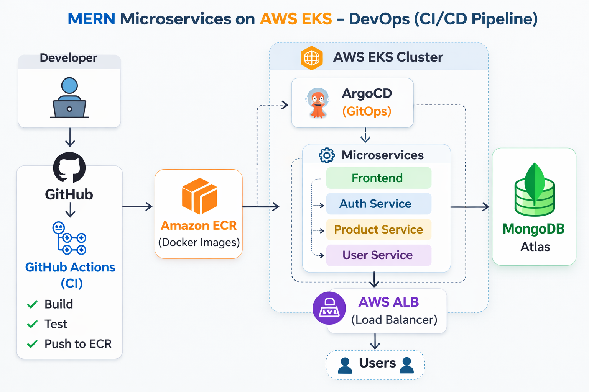

# 🛒 ProShop — MERN Microservices Deployed on AWS EKS


A production-grade **eCommerce platform** built with the **MERN stack**, containerized using **Docker**, and deployed on **AWS EKS** with a fully automated **GitOps CI/CD pipeline** using **GitHub Actions** and **ArgoCD**.

This project demonstrates **real-world DevOps practices** such as **Infrastructure as Code (Terraform), containerized microservices, Kubernetes orchestration, GitOps continuous delivery, and cloud-native architecture on AWS**.

---

# ✨ Features

- 🧩 Microservices-based architecture with 4 independent services  
- ⚙️ Fully automated CI/CD pipeline using GitHub Actions  
- 🔄 GitOps continuous deployment using ArgoCD  
- 🏗️ Infrastructure provisioned with Terraform (IaC)  
- 🐳 Containerized services using Docker  
- ☸️ Kubernetes orchestration on AWS EKS  
- 🌐 AWS ALB Ingress for intelligent traffic routing  
- 🔒 Secure secret management with Kubernetes secrets  
- 🚀 Zero-downtime rolling deployments  

---

# 🚀 Key DevOps Highlights

- End-to-end CI/CD pipeline using GitHub Actions  
- GitOps continuous deployment using ArgoCD  
- Infrastructure fully automated using Terraform  
- Microservices containerized using Docker  
- Kubernetes deployment on AWS EKS  
- AWS ALB Ingress for traffic routing  
- Secure secret management with Kubernetes Secrets  

---

# 🏗️ System Architecture



```
User Browser
      │
      ▼
AWS Application Load Balancer (ALB)
      │
      ├── /                → Frontend Service (React + Nginx)
      ├── /api/auth        → Auth Service (Node.js)
      ├── /api/products    → Product Service (Node.js)
      └── /api/users       → User Service (Node.js)
                                │
                                ▼
                         MongoDB Atlas
```

---

# 📸 Screenshots

### ArgoCD Dashboard


### Application UI


---

# 🧱 Tech Stack

| Layer | Technology |
|------|------------|
| Frontend | React.js, Redux, Bootstrap |
| Backend | Node.js, Express.js |
| Database | MongoDB Atlas |
| Containerization | Docker |
| Container Registry | AWS ECR |
| Orchestration | Kubernetes (AWS EKS) |
| Infrastructure | Terraform |
| CI | GitHub Actions |
| CD | ArgoCD (GitOps) |
| Ingress | AWS ALB Controller |
| Networking | AWS VPC, NAT Gateway |

---

# 📁 Project Structure

```
aws-eks-project3/

.github/workflows/
   auth-ci.yml
   frontend-ci.yml
   product-ci.yml
   user-ci.yml

argocd/
   application.yaml

backend/microservices/
   auth-service/
   product-service/
   user-service/

frontend/

infrastructure/terraform/
   alb-controller.tf
   alb-service-account.tf
   argocd.tf
   main.tf
   output.tf
   providers.tf
   variables.tf

k8s-deployments/
   auth-service/
   product-service/
   user-service/
   frontend/
   ingress.yaml
   namespace.yaml
   mongo-secret.yaml
```

---

# 🚀 End-to-End Deployment Workflow

```
Developer pushes code
        │
        ▼
GitHub Actions CI triggered
        │
        ├ Checkout code
        ├ Configure AWS credentials
        ├ Login to AWS ECR
        ├ Build Docker image
        ├ Push image to ECR
        ├ Update Kubernetes deployment manifest
        └ Commit updated manifest

        │
        ▼
ArgoCD detects repository change
        │
        ├ Pull latest manifests
        ├ Apply manifests to EKS
        └ Rolling update deployment

        ▼
New version deployed to AWS EKS
```

---

# 🔧 Prerequisites

- AWS Account  
- Terraform >= 1.5  
- Docker  
- kubectl  
- GitHub repository  

Required GitHub Secrets:

| Secret | Description |
|------|-------------|
| AWS_ACCESS_KEY_ID | AWS IAM access key |
| AWS_SECRET_ACCESS_KEY | AWS IAM secret |
| AWS_REGION | AWS region |
| ECR_REGISTRY | AWS ECR registry URL |

---

# 🏗️ Provision Infrastructure

```
cd infrastructure/terraform

terraform init
terraform plan
terraform apply
```

Terraform creates:

- VPC  
- Public and Private Subnets  
- NAT Gateway  
- EKS Cluster  
- Node Group  
- IAM Roles  
- AWS Load Balancer Controller  
- ArgoCD  

---

# 🌐 Traffic Routing

AWS ALB routes requests:

```
/                → frontend-service
/api/auth        → auth-service
/api/products    → product-service
/api/users       → user-service
```

---

# ☸️ Kubernetes Resources

| Service | Type | Port |
|------|------|------|
| frontend-service | ClusterIP | 80 |
| auth-service | ClusterIP | 5001 |
| product-service | ClusterIP | 5002 |
| user-service | ClusterIP | 5003 |

Namespace used:

```
mern-dev
```

---

# 💻 Local Development

Clone repository:

```
git clone https://github.com/Latha1722/aws-eks-project3.git
cd aws-eks-project3
```

Run backend service:

```
cd backend/microservices/auth-service
npm install
npm start
```

Run frontend:

```
cd frontend
npm install
npm start
```

Create `.env` file before running locally.

---

# 🔐 Secrets Management

MongoDB connection string is stored in a **Kubernetes Secret**.

Example:

```yaml
apiVersion: v1
kind: Secret
metadata:
  name: mongo-secret
  namespace: mern-dev
type: Opaque
```

Never commit:

- terraform.tfstate  
- terraform.tfvars  
- secret files  

---

# ⭐ DevOps Skills Demonstrated

| Skill | Tool |
|------|------|
| Infrastructure as Code | Terraform |
| Containerization | Docker |
| Orchestration | Kubernetes (EKS) |
| Continuous Integration | GitHub Actions |
| Continuous Deployment | ArgoCD |
| Cloud Networking | AWS VPC, ALB |
| Secret Management | Kubernetes Secrets |
| Container Registry | AWS ECR |

---

# 👩‍💻 Author

**Latha Paladugu**

DevOps Engineer  
AWS | Kubernetes | Terraform | Docker | GitHub Actions | ArgoCD

---

# 📄 License

This project is licensed under the **MIT License**.
